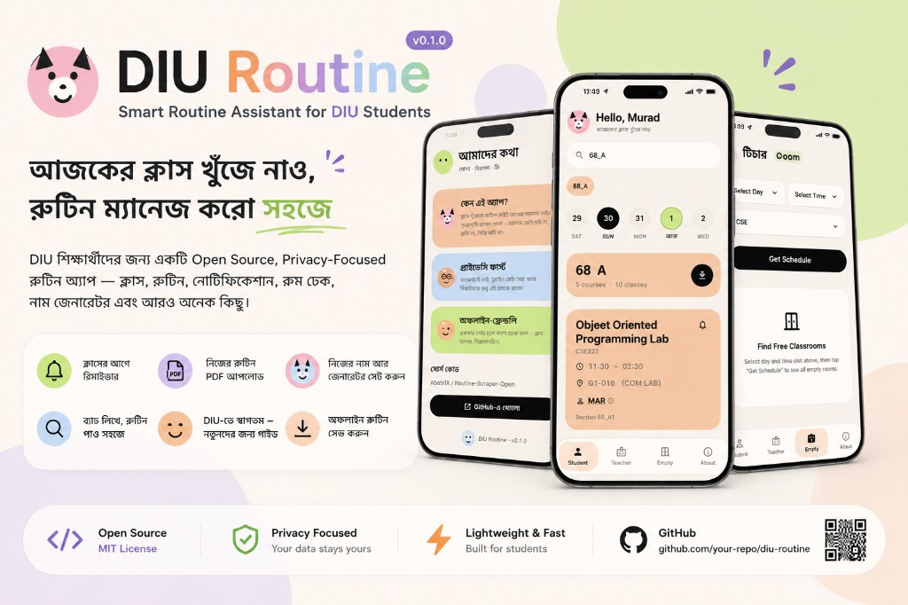

# DIU Routine

<p align="center">
  
</p>

DIU স্টুডেন্টদের জন্য সহজ ক্লাস রুটিন অ্যাপ। ব্যাচ লিখো — আজকের ক্লাস, ব্রেক, আর সারা সপ্তাহ এক জায়গায়।

অ্যাকাউন্ট লাগে না। বিজ্ঞাপন নেই। ডেটা সংগ্রহ নেই। কোড খোলা (GPL-3.0)।

|             |                               |
| ----------- | ----------------------------- |
| অ্যাপ নাম   | DIU Routine                   |
| প্ল্যাটফর্ম | Android + iOS                 |
| ভার্সন      | 0.1.0                         |
| ডাউনলোড     | [GitHub Releases](https://github.com/AbabilX/Routine-Scrapper-Open/releases) (Android APK) |
| লাইসেন্স    | [GPL-3.0](LICENSE)            |
| সোর্স       | [GitHub](https://github.com/AbabilX/Routine-Scrapper-Open) |

---

## তুমি কী পাবে

- **নিজের ব্যাচের রুটিন** — `70_E` লিখলেই সাজেশন, সিলেক্ট করলে সপ্তাহের শিডিউল
- **টিচারের ক্লাস** — ইনিশিয়াল দিয়ে সার্চ, দিন বা সপ্তাহ ভিউ
- **খালি রুম** — দিন ও সময় বেছে কোন রুম ফাঁকা জানো
- **ক্লাসের আগে বেল** — ৫ / ১০ / ১৫ / ২০ / ৩০ মিনিট আগে লোকাল রিমাইন্ডার
- **সপ্তাহের PDF** — অ্যাপেই তৈরি হয়, শেয়ার করতে পারো (WhatsApp, Drive, ইত্যাদি)
- **অফলাইনেও চলে** — শেষবারের রুটিন ফোনে সেভ থাকে
- **প্রাইভেসি** — ট্র্যাকিং নেই, অ্যাকাউন্ট নেই, নোটিফিকেশন ফোনের বাইরে যায় না

ট্রাই করতে অ্যাপে সার্চ বক্সে **`70_E`** দাও।

---

## ফিচার

### স্টুডেন্ট
ব্যাচ/সেকশন সার্চ → আজকের টাইমলাইন (এখন / পরের ক্লাস) → শনি–বৃহস্পতি ডেট স্ট্রিপ → এনরোল্ড কোর্স সারাংশ → PDF ডাউনলোড।

ল্যাব পাশাপাশি থাকলে এক কার্ডে দেখায়; মাঝের ফাঁক **Break** হিসেবে চিহ্নিত।

### টিচার
টিচার ইনিশিয়াল সার্চ, সাজেশন থেকে সিলেক্ট, দিনভিত্তিক বা সাপ্তাহিক ভিউ, একইভাবে PDF শেয়ার।

### খালি রুম
দিন, সময় (ও ডিপার্টমেন্ট) বেছে খালি ক্লাসরুম খুঁজে নাও — ক্লাস মিস বা গ্রুপ স্টাডির জন্য।

### আমাদের কথা
প্রজেক্ট ওপেন সোর্স, প্রাইভেসি-ফোকাসড — সোর্স কোড GitHub-এ দেখা যায়।

### ছোট সুবিধা
- শেষ সার্চ মনে রাখে
- প্রথমবার অনবোর্ডিং ট্যুর
- কিউট লাইট UI — হেডারে জেন্ডার অনুযায়ী ফেস আইকন

---

## কাদের জন্য

| কে                    | কেন উপকারী                                      |
| --------------------- | ----------------------------------------------- |
| DIU CSE স্টুডেন্ট     | নিজের সেকশনের রুটিন এক ট্যাপে                   |
| গ্রুপ স্টাডি / মিটিং  | খালি রুম খুঁজে পাওয়া                           |
| ক্লাস মিস করতে ভয়    | লোকাল রিমাইন্ডার                                |
| রুটিন শেয়ার করতে চায় | পরিষ্কার টেবিল PDF                              |
| ওপেন সোর্স পছন্দ      | কোড পড়া, ফোর্ক, কন্ট্রিবিউট — GPL-3.0          |

এই ভার্সনে মূল ফোকাস **CSE**।

---

## চালানো (ডেভেলপার)

1. [Flutter SDK](https://docs.flutter.dev/get-started/install) (3.12+) ইনস্টল করো
2. `.env.example` কপি করে `.env` বানাও এবং প্রয়োজনীয় ভ্যালু দাও
3. রান করো:

```bash
cp .env.example .env
flutter pub get
flutter run --dart-define-from-file=.env
```

APK (ABI আলাদা — বেশিরভাগ ফোনে `arm64-v8a`):

```bash
flutter build apk --release --split-per-abi --dart-define-from-file=.env
```

`main`-এ পুশ হলে Actions `pubspec.yaml` প্যাচ বাম্প করে (`0.1.0+1` → `0.1.1+2`), স্প্লিট APK বানায়, বাম্প কমিট পুশ করে, তারপর [Releases](https://github.com/AbabilX/Routine-Scrapper-Open/releases)-এ তোলে। রেপো Secret লাগে: `API_BASE_URL` আর `API_ENDPOINTS_ENV` (হোস্ট/পাথ কমিট করো না)।

Cursor / VS Code-এ `.vscode/launch.json` আগে থেকেই সেটআপ করা আছে।

বিস্তারিত আর্কিটেকচার: [PROJECT.md](PROJECT.md)

---

## সমস্যা হলে

| সমস্যা                           | কী করবে                                                   |
| -------------------------------- | --------------------------------------------------------- |
| `flutter` কমান্ড নেই             | Flutter SDK PATH-এ দাও                                    |
| `API_BASE_URL is not configured` | `.env` + `flutter run --dart-define-from-file=.env`       |
| `API endpoint paths are not configured` | `.env`-এ `.env.example`-এর `API_PATH_*` কীগুলো ভরা আছে কিনা |
| সার্চ খালি                       | ফরম্যাট `70_E` — স্পেস বাদ                                |
| PDF শেয়ার খোলে না               | emulator-এ শেয়ার টার্গেট নাও থাকতে পারে — ফোনে ট্রাই করো |

---

## কন্ট্রিবিউট

ছোট PR ভালো। আগে ইস্যু খুলে এক লাইনে আইডিয়া লিখে ফেলো।

- [ ] `flutter analyze`
- [ ] `flutter test --dart-define-from-file=.env`
- [ ] PR-এ `.env` নেই
- [ ] ডিভাইসে `70_E` সার্চ করে দেখেছ

---

## ক্রেডিট ও লাইসেন্স

কোড **GNU GPL-3.0** — [LICENSE](LICENSE)।

ব্যবহার, পড়া, কন্ট্রিবিউট, ফোর্ক করা যায়। মডিফাই করে ডিস্ট্রিবিউট করলে একই GPL ও সোর্স দিতে হবে।

রুটিন **DIU CSE Class Routine Committee**-এর। এই অ্যাপ সেটা শুধু দেখায়; অফিসিয়াল রুটিনের মালিকানা বিশ্ববিদ্যালয়ের।

